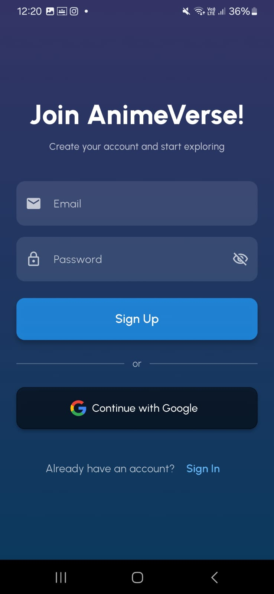
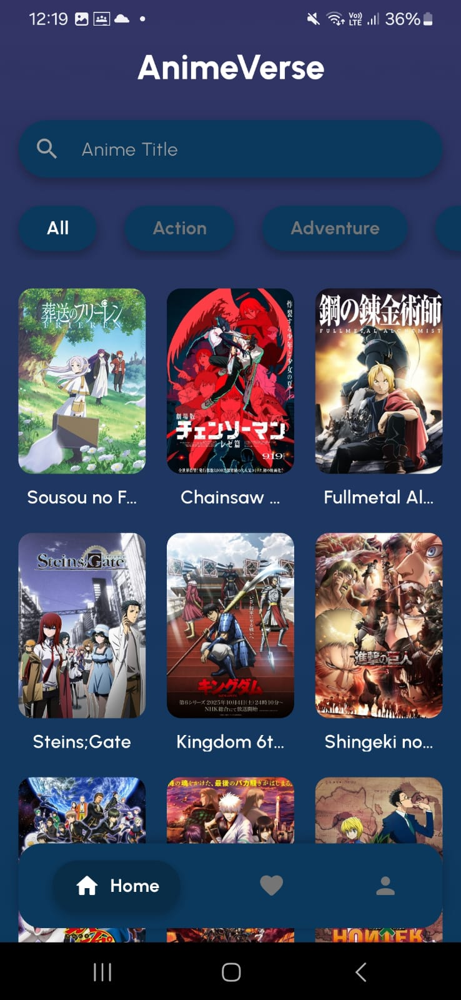
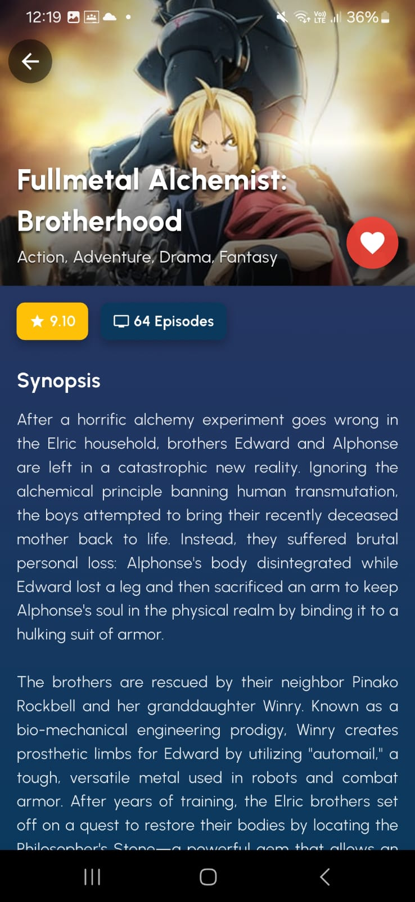
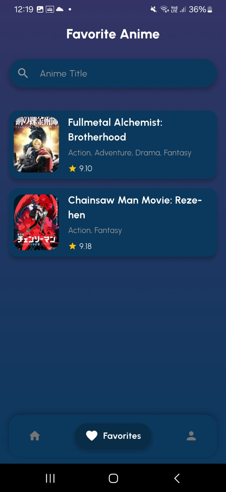
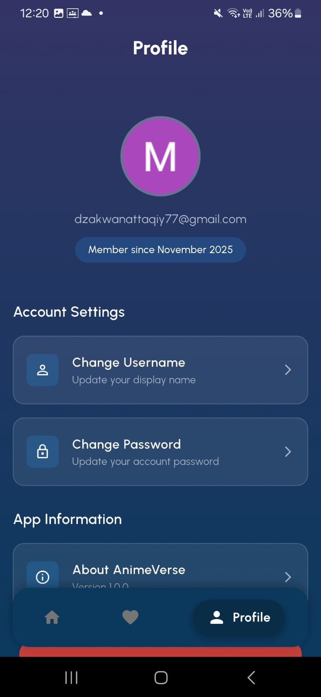

# AnimeVerse Flutter App

## A. Identitas Mahasiswa
- **Nama:** Muhammad Dzakwan Attaqiy  
- **NIM:** 231401055  
- **Lab:** 2  

## B. Project Description
Aplikasi ini dibuat dengan **Flutter**, merupakan aplikasi yang menampilkan daftar anime berdasarkan genre. Pengguna dapat menyimpan anime favoritnya, serta aplikasi ini memiliki fitur **login autentikasi Google** dan terintegrasi dengan **Firebase**.

## C. Screenshots Aplikasi
Berikut beberapa tampilan dari aplikasi AnimeVerse:

1. **Sign Up Screen**  
   

2. **Sign In Screen**  
   
   
3. **Home Screen**  
   

4. **Anime Detail Screen**  
   

5. **Favorites Screen**  
   

6. **Profile Screen**  
   

## D. Link Demo Aplikasi
[Demo](https://youtu.be/A0ADB8931mA)

